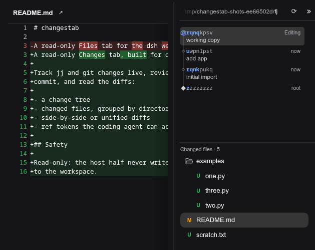
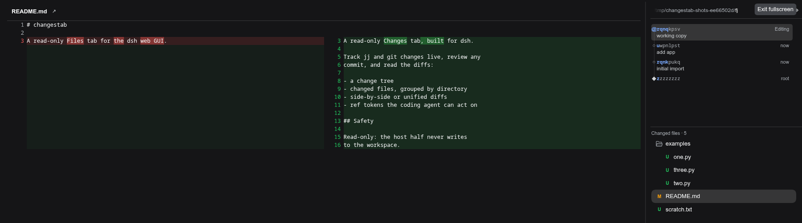

[](https://www.npmjs.com/package/changestab)
[](./LICENSE)

#  changestab

English | [中文](README.zh.md)

Provides a sidebar Changes view for [DeepSeek Harness](https://github.com/deepseek-ai/dsh) 

Supports navigating the change history and viewing file diffs side-by-side or stacked depending on available display width.





## Install

```sh
dsh plugin --profile web add changestab
```

Install it into the web profile, the one that runs the GUI.

## Development

To test a local checkout instead of the published package, install it directly: `dsh plugin --profile web add /path/to/changestab`

For a source checkout or local path install, run `pnpm install && npm run build` first so the bundle exists.

```sh
pnpm install     # a local (uncommitted) .npmrc may pin the pnpm store repo-locally
npm run build    # tsc (host + client) + tsdown bundle
npm test         # build + the full suite (pure parser tests + real jj/git I/O when the binaries are on PATH)
npm run e2e      # browser journeys against a sandboxed dsh instance
```

[CHANGELOG.md](CHANGELOG.md) · [Releases](https://github.com/americanjeff/changestab/releases).
