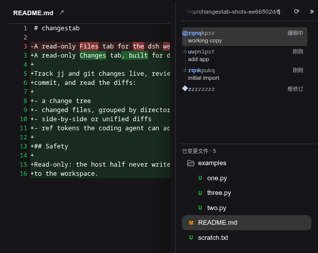
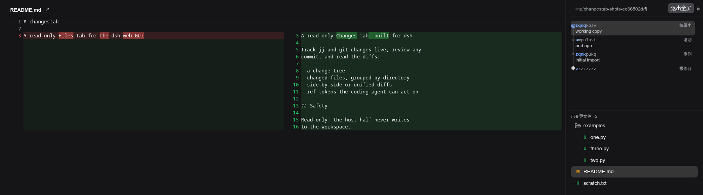

[](https://www.npmjs.com/package/changestab)
[](./LICENSE)

#  changestab

[English](README.md) | 中文

为 [DeepSeek Harness](https://github.com/deepseek-ai/dsh) 提供侧边栏 Changes 视图 

支持导航变更历史，并根据可用显示宽度以并排或堆叠方式查看文件 diff。





## 安装

```sh
dsh plugin --profile web add changestab
```

请安装到 web profile，即运行 GUI 的那个 profile。

## 开发

要测试本地检出（而非已发布的包），可以直接安装：`dsh plugin --profile web add /path/to/changestab`

源码检出或本地路径安装请先运行 `pnpm install && npm run build` 生成 bundle。

```sh
pnpm install     # 本地（未提交的）.npmrc 可将 pnpm store 固定在仓库内
npm run build    # tsc（宿主端 + 客户端）+ tsdown 打包
npm test         # 构建 + 完整测试套件（纯解析器测试 + jj/git 在 PATH 时做真实 I/O）
npm run e2e      # 针对沙盒 dsh 实例的浏览器旅程
```

[CHANGELOG.md](CHANGELOG.md) · [Releases](https://github.com/americanjeff/changestab/releases)。
